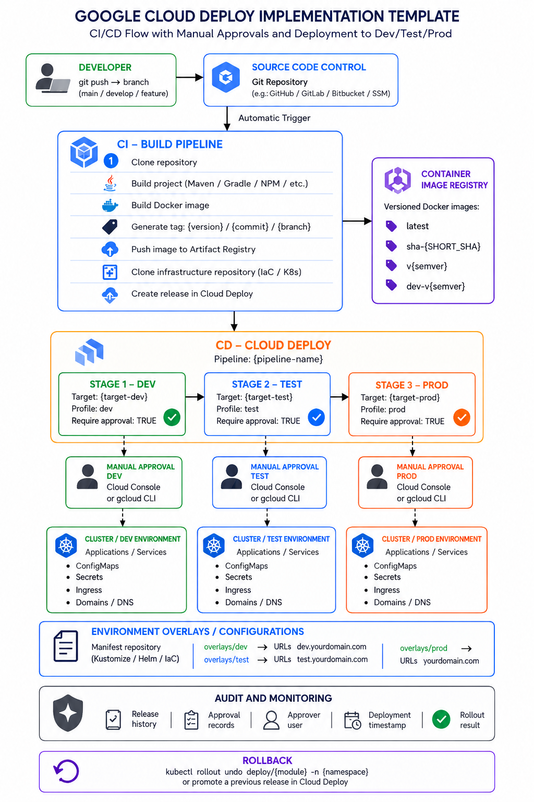

# GKE Multi-Environment CI/CD Reference Pipeline

A sanitized, reusable reference implementation of a multi-environment CI/CD
pipeline on Google Cloud, built from patterns I use in production for a
national-scale platform. No client-specific names, domains, project IDs, or
credentials are included — everything here uses placeholder values
(`my-gcp-project`, `example.com`, `sample-app`) so it can be dropped into any
GCP project and adapted.



## The app

`app/` is a deliberately trivial Spring Boot service — one endpoint that
returns its own version and log-level, both sourced from the environment's
ConfigMap. It exists purely to make the pipeline demonstrable: deploy the
same image to `dev`, `test`, and `prod` and `GET /` returns different config
per environment, with no code change. `/health` (via Spring Actuator) backs
the readiness/liveness probes in `gke-manifests/base/deployment.yaml`.

## What this shows

- **Cloud Build** as the CI stage: build the app, build/tag/push a container
  image to Artifact Registry, then hand off to CD.
- **Cloud Deploy** as the CD stage: a delivery pipeline that progressively
  rolls a release through `dev -> test -> prod`, with a manual approval gate
  before every stage — including dev, so nothing lands anywhere without a
  human confirming it.
- **Kustomize** for per-environment configuration: one base manifest set,
  three overlays (`dev`, `test`, `prod`) that vary replica counts, resource
  limits, ingress hostnames, and autoscaling — without duplicating the base
  YAML.
- **Skaffold** as the glue between Cloud Deploy and the Kustomize manifests,
  with per-environment profiles and generous `statusCheckDeadlineSeconds` for
  slower environments.

## Repo layout

```
app/                         # minimal Spring Boot service (see "The app" above)
.github/workflows/build.yml  # CI sanity check: mvn package + docker build on every push
cloudbuild.yaml              # CI pipeline definition
skaffold.yaml                # deploy config consumed by Cloud Deploy
clouddeploy.yaml             # delivery pipeline + target (dev/test/prod) definitions
gke-manifests/
  base/                      # shared Deployment, Service, ConfigMap, PDB
  overlays/
    dev/                     # dev-specific ingress + image tag
    test/                    # test-specific ingress + image tag
    prod/                    # prod-specific ingress, HPA, resource patch
docs/
  pipeline-diagram.png
```

## Design decisions worth calling out

**Multiple image tags, one build.** Every build is tagged `latest`,
`sha-<commit>`, and a human-readable `v<date>.<time>` semver. The semver tag
is what actually gets deployed — `latest` is for local debugging only, and
the commit SHA tag makes any running image traceable back to an exact commit
without needing to check build logs.

**Digest resolution without extra IAM permissions.** The obvious way to
resolve an image's digest after pushing is
`gcloud artifacts docker images describe`. In practice, that call also
queries Container Analysis for vulnerability metadata, which requires
`containeranalysis.occurrences.list` — a permission the Cloud Build service
account frequently does *not* have, and granting it is often more friction
than it's worth for a step that just needs a digest string. This pipeline
gets the digest from `docker inspect` on the already-pushed image instead:
zero extra permissions, zero extra API calls.

**Manual approval on every stage, including dev.** It's tempting to auto-
deploy to dev and only gate test/prod. In practice, an unreviewed dev
deploy can still race with someone actively debugging that environment.
Approval gates are cheap; a confusing "why did my environment just change
under me" incident is not.

**PodDisruptionBudget + `safe-to-evict: false` by default.** On GKE
Autopilot, the built-in bin-packing optimizer will relocate pods for node
consolidation. For most stateless workloads this is invisible. For anything
with a PersistentVolume attached (or adjacent to one), a mistimed relocation
can strand a volume mid-detach on a node that then gets torn down — which
turns into an availability incident that has nothing to do with your
application code. The annotation and PDB here are the cheap insurance
against that.

## Rollback

```
kubectl rollout undo deployment/sample-app -n <namespace>
```

or promote a previous Cloud Deploy release back through the pipeline —
`clouddeploy.yaml`'s release history keeps every prior release addressable
by name.

## Adapting this for your own project

1. Replace `my-gcp-project`, `my-registry`, `your-org`, and the `example.com`
   hostnames throughout.
2. Point `clouddeploy.yaml`'s `gke:` cluster paths at your real clusters.
3. Wire `cloudbuild.yaml` as a Cloud Build trigger on your app repo.
4. Adjust `gke-manifests/base` to match your actual container port, health
   check paths, and resource footprint.
